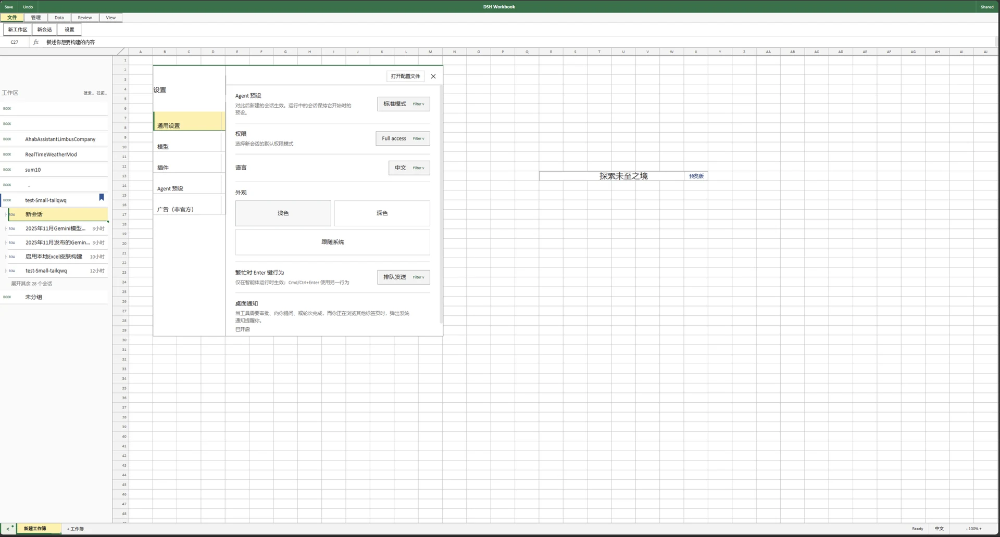

# Deepcel · Excel 风格工作簿皮肤

> 把 DeepSeek Harness WebUI 变成一张 **可识别、好用** 的 Excel 电子表。
> 为 dsh 皮肤中心 v2（skin-center v2）打造的资产皮肤，经 `skin.json` + `hooks.mjs` 加载，
> 在原 cordis 皮肤基础上**完全重构**——保留 Excel 观感，同时让侧栏、设置、会话、输入都真正可用。



---

## ✨ 特性

### 顶部 Excel 功能区（Ribbon）
- **九大标签**：文件 · 开始 · 插入 · 页面布局 · 公式 · 数据 · 审阅 · 视图 · 帮助
- **按标签切换的多组图标命令**：开始页渲染 剪贴板 / 字体 / 对齐方式 / 数字 / 样式 / 单元格 / 编辑 / 加载项 等分组，组名在底部
- 每组是「大命令 + 小命令堆叠」的 Excel 式布局，命令区约 96px，横向可滚动、**绝不换行挤爆**
- 图标为内联 SVG（`currentColor` 着色），不依赖图标库

### 公式栏（Formula Bar）
- `[名称框] · fx · [输入框]` 三段式公式栏，输入框**内嵌在 fx 之后**，对齐原生公式栏语义
- 输入框聚焦有绿色高亮边框

### 工作表网格（Grid）
- 工作表区以**单元格网格 + 行号 + 列头**呈现，A/B/C… 列、1/2/3… 行的 Excel 背景
- 网格为视觉层（`pointer-events: none`），原生内容可自由滚动、点击、交互

### 真正可用的功能
- **小箭头侧栏开关**（左上 `▶`/`◀`）：一键开合 DeepSeek 原生侧边栏
- **设置**：文件标签下的「设置」按钮，打开原生设置面板
- **新会话 / 新工作区**：文件标签下的一键入口，调用原生行为
- **加载项 · 退出**：一键返回 DeepSeek 官方默认皮肤

### 主题
- Excel 绿主题（`#217346`），标题栏绿色、活动标签白色、分组浅绿高亮
- 深色 / 浅色预览图

---

## 🚀 安装

### 皮肤中心方式（推荐）
1. 打开 dsh 的 **皮肤中心**（设置 → 皮肤/皮肤中心）
2. 选择 **Deepcel 工作簿**，点击「应用」
3. 刷新页面即可看到 Excel 式界面

### 手动放置
把本仓库的皮肤文件放入皮肤目录：

```bash
# Linux / macOS
mkdir -p ~/.dsh/skins/deepcel
cp skin.json skin.css patches.css hooks.mjs {preview}/*.webp ~/.dsh/skins/deepcel/

# Windows
mkdir %USERPROFILE%\.dsh\skins\deepcel
copy skin.json skin.css patches.css hooks.mjs %USERPROFILE%\.dsh\skins\deepcel\
```

然后确认皮肤中心 `active` 指向 `deepcel`：

```bash
curl -X POST http://127.0.0.1:3080/api/skin-center/v2/active \
  -H 'content-type: application/json' -d '{"active":"deepcel"}'
```

刷新页面，`<html>` 会带有 `data-dsh-skin="deepcel"` 并注入皮肤 CSS。

---

## 🖱 使用说明

| 元素 | 位置 | 作用 |
| --- | --- | --- |
| 标签页 | 功能区顶部 | 切换不同功能组 |
| 功能组按钮 | 标签下方 96px 条 | Excel 命令（装饰），悬停有浅绿高亮 |
| 公式栏 | 功能区下方 | `[B4] · fx · 输入框` |
| 侧栏箭头 `▶`/`◀` | 左上 | 开合原生侧边栏 |
| 设置 | 文件 → 设置 | 打开原生设置 |
| 新会话 / 新工作区 | 文件 | 创建会话 / 工作区 |
| 加载项 · 退出 | 每个标签末尾 | 返回官方默认皮肤 |

> 功能区的「命令」按钮为 Excel 观感装饰（保留 hover 反馈），真正的工作流由
> 侧栏、设置、会话、输入框等原生能力承载——**像 Excel，且好用**。

---

## 🧩 文件结构

```
dsh-deepexcel/
├── skin.json          # 皮肤中心 v2 清单 (skinManifestVersion: 2)
├── skin.css           # 设计 token + 基础重置
├── patches.css        # Excel chrome 布局样式（强制作用域到 html[data-dsh-skin=deepcel]）
├── hooks.mjs          # 皮肤中心 hooks：构建 chrome / 网格 / 公式栏 / 侧栏开关
├── preview/
│   ├── light.webp     # 浅色预览
│   └── dark.webp      # 深色预览
├── README.md
├── LICENSE            # BSD-3-Clause
└── docs/              # GitHub Pages 预览
```

---

## 🔧 皮肤中心契约

- `skin.json`：`contributes.stylesheet` → `skin.css`，`contributes.patches` → `patches.css`，
  `facets.client.entry` → `hooks.mjs`，`apiVersion` = `x-org.linxin666.skin-center/v1alpha1`
- `hooks.mjs`：`export default defineSkinHooks()` 返回 `{ apply(ctx) }`；`ctx.onCleanup` 负责卸载
- CSS 由皮肤中心强制作用域到 `html[data-dsh-skin="deepcel"]`，无需担心污染全局
- `dsh-market.provenance.json`：记录运行时文件的 sha256，用于 `canServeSkinHooks` 信任校验

---

## 📄 许可

[BSD-3-Clause](LICENSE)。原皮肤来自 [Small-tailqwq/dsh-deepcel](https://github.com/Small-tailqwq/dsh-deepcel)。

由 **Jensen-Yao** 重构为 v2 资产皮肤。
